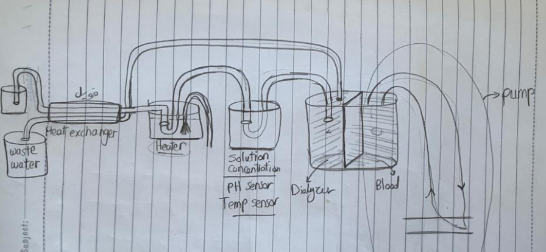

# Hemodialysis-Monitoring-Desktop-App

## Table of contents:
- [Introduction](#introduction)
- [Hardware](#used-hardware-components)
- [Quick Preview](#quick-preview)
- [How to Run The Project](#run-the-project)
- [Team]()

### Introduction
Hemodialysis is one of the most important devices in healthcare facilities, it's a life support
device which saves a lot of lives by its mechanism.

a machine filters wastes, salts and fluid from your blood when your kidneys are no longer
healthy enough to do this work adequately. Hemodialysis (he-moe-die-AL-uh-sis) is one way 
to treat advanced kidney failure and can help you carry on an active life despite failing kidneys.


This machine needs to be monitored carefully because its parameters is very important. Our Prototype
contains both hardware prototype and the associated software desktop application.



### Used Hardware Components
- Arduino UNO (AVR-Based)
- Water Temperature Sensor
- Ultrasound Sensor
- Color Sensor
- 2 x Water 6-9 V Pump
- NPN BJT Transistor

### Project Work Flow
The Arduino makes all its interfacing with the sensors and calculates the values and then
send them to the PC with serial port. The PC reads the serial port using NodeJS and then send these
values to the front-end by a repeated AJAX request-response


### Quick Preview


### Run the Project 
1- Install NodeJS on your PC
``` 
Download it from nodejs.org/en/download/
```

2- Install Required node modules

```shell
npm install
```

3- Run Server

```shell
cd src/server
node ./ports.js
```

4. Run the Electron Application 
```shell
cd ../../
npm start
```


### Team
First Semester - Medical Instrumentation (SBE3120) class project created by:

| Team Members                                         |     Team     |
|------------------------------------------------------|:------------:|
| [Ibrahim Mohamed](https://github.com/1brahimmohamed) |   Software   |
| [Maye Khaled](https://github.com/mayekhaled0)        |   Hardware   |
| [Mahmoud Yasser](https://github.com/mahmoud1yaser)   |   Software   |
| [Mohamed Ismail](https://github.com/MohamedAIsmail)  |   Hardware   |
| [Maha Medhat](https://github.com/mahamedhat)         |   Hardware   |
| [Neveen Mohamed](https://github.com/NeveenMohamed)   |   Hardware   |


### Submitted to:
- Eng. Peter Salah
  All rights reserved © 2022 to Team 2 - Systems & Biomedical Engineering, Cairo University (Class 2024)